# 🌍 Analyse temporelle et prédictive de la qualité de l’air en Inde (2015–2020)

**Objectif:** Étudier l’évolution quotidienne de la pollution atmosphérique (AQI) dans les grandes villes indiennes (2015–2020) et **prédire** l’AQI à court/moyen terme pour **anticiper les risques sanitaires et environnementaux**.

**Problématiques**
1) Comment l’évolution quotidienne de la pollution a-t-elle varié entre 2015 et 2020 ?  
2) Dans quelle mesure peut-on **prédire l’AQI** (court/moyen terme) pour alerter plus tôt les décideurs et le public ?

---

## 🔎 Résumé exécutif

- **EDA** : pics hivernaux récurrents (nov–jan), amélioration nette pendant la mousson (juin–sept).  
- **Variabilité spatiale** : Delhi ≫ Kolkata/Guwahati ≫ villes du sud (Coimbatore, Amaravati).  
- **Modélisation** (Random Forest) : **R² = 0.903**, MAE = 18.96, RMSE = 33.78.  
- **Prévision** (Prophet – Delhi) : légère **tendance baissière** depuis ~2017, **saisonnalité persistante** (pics hivernaux).  
- **Polluants clés** : **PM₂.₅** et **PM₁₀** dominent l’explication de l’AQI.

---

## 🧰 Stack & méthodes

- **Langages** : Python (pandas, numpy)
- **ML / Time series** : scikit-learn (RandomForestRegressor), Prophet.  
- **Dataviz** : matplotlib, seaborn, **Folium** (carte).  
- **Repro** : notebooks `.ipynb`, environnement conda/venv, `requirements.txt`.

---

## 📦 Données

- **Source** : *Central Pollution Control Board (CPCB, India)* — fichier `city_day.csv` (agrégation quotidienne par ville).  
- **Variables clés** : `City, Date, PM2.5, PM10, NO, NO2, NOx, NH3, CO, SO2, O3, Benzene, Toluene, Xylene, AQI, AQI_Bucket`.  
- **OMS (seuils recommandés)** : PM₂.₅ 15 µg/m³ (24h), PM₁₀ 45 µg/m³ (24h), NO₂ 25 µg/m³ (24h), O₃ 100 µg/m³ (8h) [(WHO, 2021)](https://www.who.int/publications/i/item/9789240034228).

➡️ **Prétraitements** :  
- Interpolation **linéaire par ville** des valeurs manquantes, suppression de `Xylene` (>60% NA).  
- Création : `Year`, `Month`, `Season` (Winter, Summer, Monsoon, Autumn), moyennes mobiles (7/30 j).  
- Sélection **Top-10 villes** (moins de NA AQI) : Delhi, Amritsar, Jorapokhar, Amaravati, Brajrajnagar, Kolkata, Guwahati, Coimbatore, Shillong, Chandigarh.

---

## 📁 Structure du repo

Voici l’organisation du projet :

```text
air_quality_forecast_india/
├─ data/
│  └─ city_day.csv
├─ notebooks/
│  ├─ 01_eda_cleaning.ipynb
│  ├─ 02_model_random_forest.ipynb
│  └─ 03_forecast_prophet_delhi.ipynb
├─ figs/
│  ├─ output_24_0.png
│  ├─ output_36_0.png
│  ├─ output_36_2.png
│  ├─ output_40_0.png
│  ├─ output_44_0.png
│  ├─ output_45_0.png
│  ├─ output_45_1.png
│  ├─ output_47_0.png
│  ├─ output_58_1.png
│  ├─ output_59_0.png
│  ├─ output_68_0.png
│  └─ output_68_1.png
├─ requirements.txt
└─ README.md
```


## 📊 Résultats clés (aperçu visuel)

**Valeurs manquantes (avant interpolation)**  
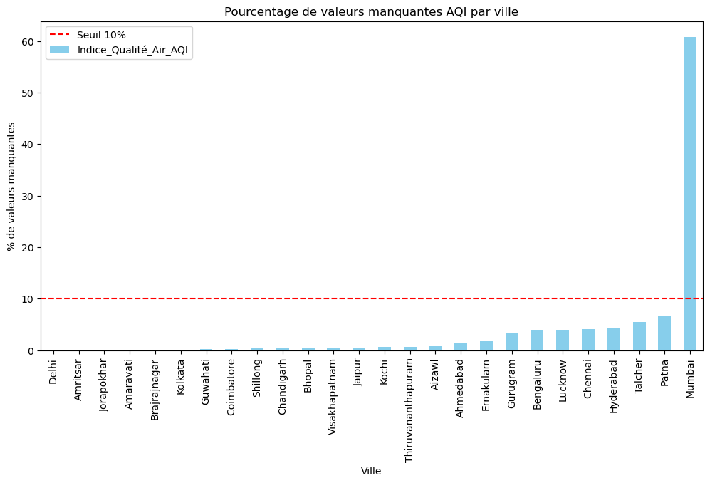

**Distribution AQI & classes**  
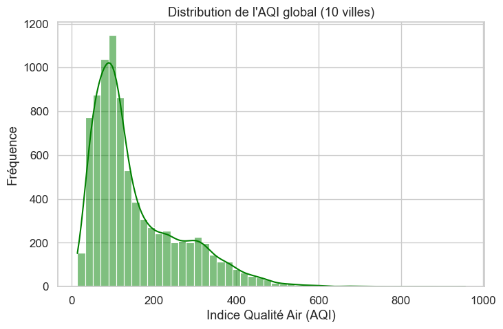  
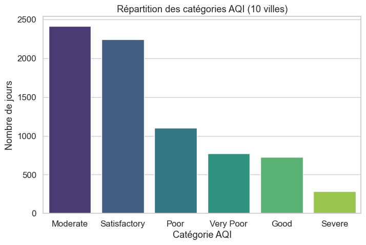

**Variabilité inter-villes (boxplot)**  
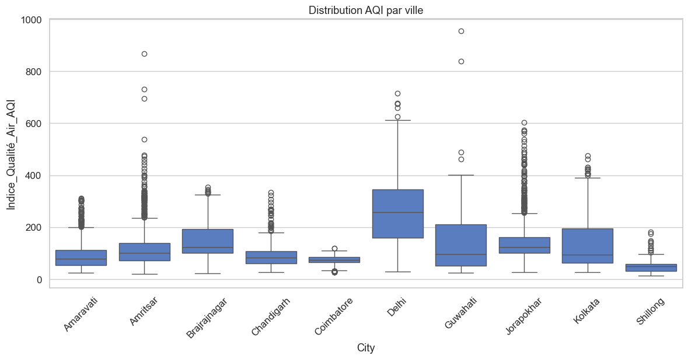

**Évolution temporelle dans 3 villes (30j)**  
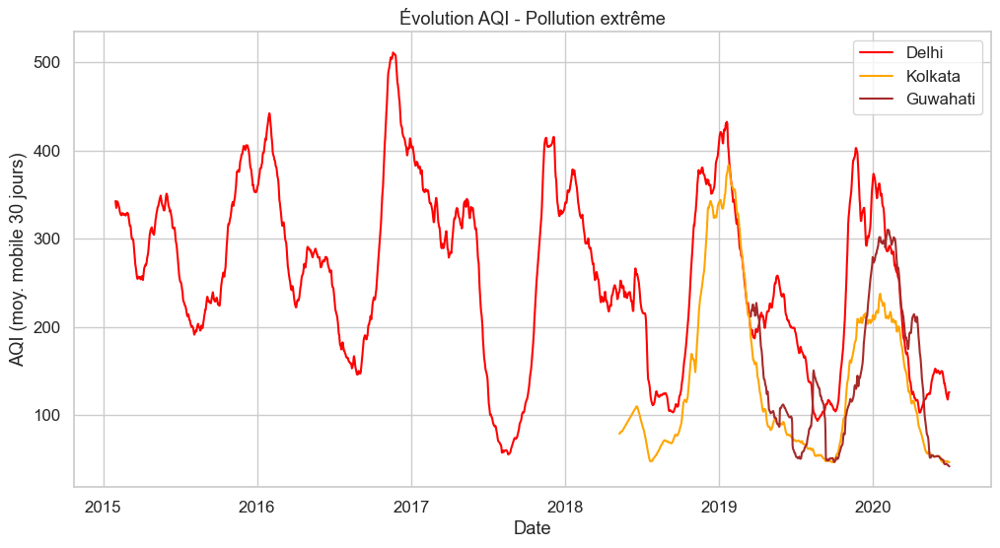

**Mensuel & saisonnier**  
 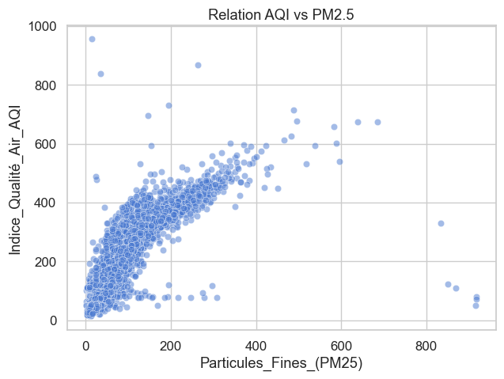

**Carte Folium — AQI moyen (2015–2020)**  
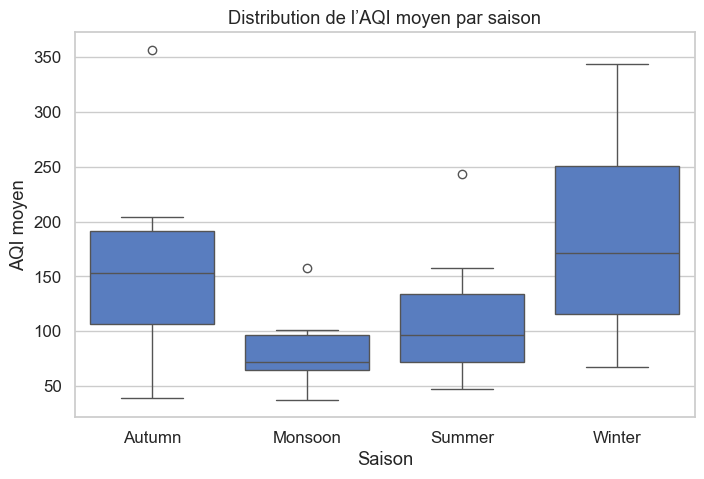

**Random Forest — importance & perf**  
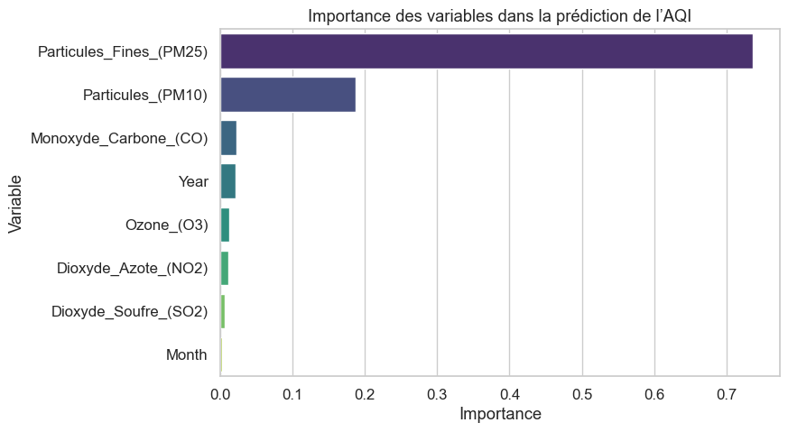 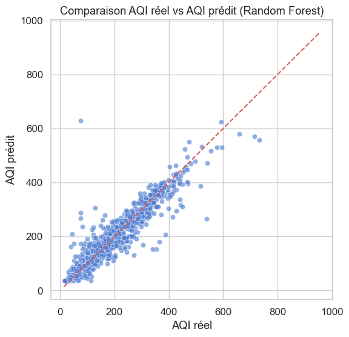

**Prophet — prévision & composantes (Delhi)**  
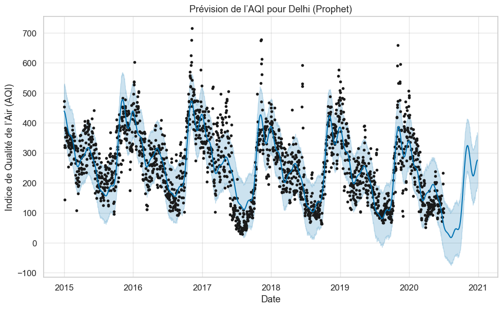  
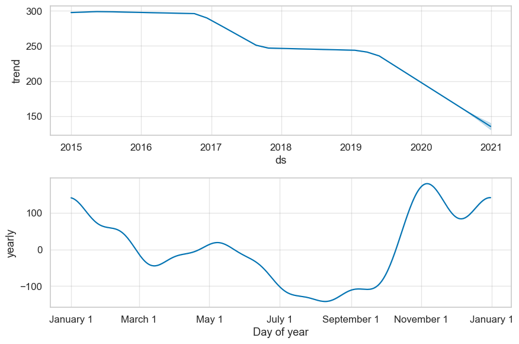

---

## 📄 Rapport complet

👉 **[Télécharger le rapport complet (PDF)](docs/rapport_AQI_Inde.pdf)**  

